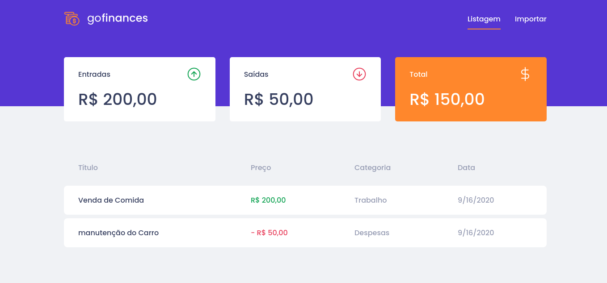
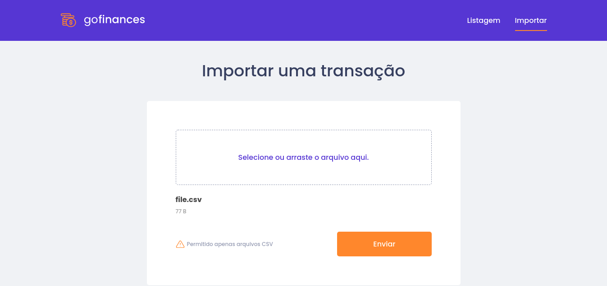

# GoFinances

Repositório para o projeto GoFinances desenvolvido durante o bootcamp GoStack 13 na [Rocketseat](https://rocketseat.com.br/).

### Descrição 

GoFinaces é uma aplicação de gestão de finanças desenvolvida utilizando Node, TypeScript,  Express, TypeORM e banco de dados postgres para sua API REST e para o front-end foi utilizado TypeScript integrado ao ReactJS. Para cadastrar novas transações é possível importar um arquivo .CSV seguindo o [modelo](https://github.com/Rocketseat/bootcamp-gostack-desafios/blob/master/desafio-database-upload/assets/file.csv). Tanto o back-end quanto o front-end foram desenvolvidos durantes desafios propostos no bootcamp GoStack 13 na [Rocketseat](https://rocketseat.com.br/).

### Como o projeto está atualmente

### License

MIT License

Copyright (c) 2020 Antonio Lisbôa

Permission is hereby granted, free of charge, to any person obtaining a copy of this software and associated documentation files (the "Software"), to deal in the Software without restriction, including without limitation the rights to use, copy, modify, merge, publish, distribute, sublicense, and/or sell copies of the Software, and to permit persons to whom the Software is furnished to do so, subject to the following conditions:

The above copyright notice and this permission notice shall be included in all copies or substantial portions of the Software.

THE SOFTWARE IS PROVIDED "AS IS", WITHOUT WARRANTY OF ANY KIND, EXPRESS OR IMPLIED, INCLUDING BUT NOT LIMITED TO THE WARRANTIES OF MERCHANTABILITY, FITNESS FOR A PARTICULAR PURPOSE AND NONINFRINGEMENT. IN NO EVENT SHALL THE AUTHORS OR COPYRIGHT HOLDERS BE LIABLE FOR ANY CLAIM, DAMAGES OR OTHER LIABILITY, WHETHER IN AN ACTION OF CONTRACT, TORT OR OTHERWISE, ARISING FROM, OUT OF OR IN CONNECTION WITH THE SOFTWARE OR THE USE OR OTHER DEALINGS IN THE SOFTWARE.